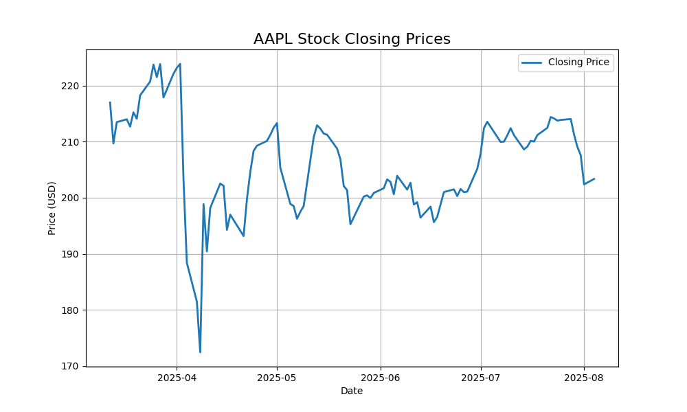

Stock Market Tracker:

A simple Python project to track real-time or historical stock prices using Alpha Vantage API, Pandas, and Matplotlib.
Technologies:
- Python
- Pandas
- Matplotlib
- Alpha Vantage API

Features:
- Pull real-time daily stock data (AAPL, GOOGL, etc.)
- Plot closing prices as line chart
- Save data to CSV and chart as PNG

How to Use:
1. Get a free API key from [Alpha Vantage](https://www.alphavantage.co/support/#api-key)
2. Replace `'your_api_key_here'` in the code
3. Run the script to generate:
   - `stock_data.csv`
   - `stock_price_chart.png`

Screenshot:

